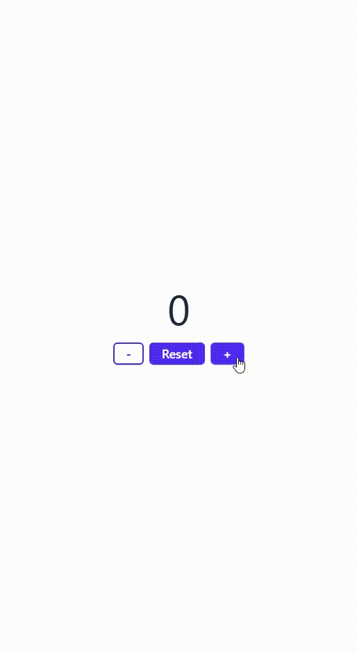
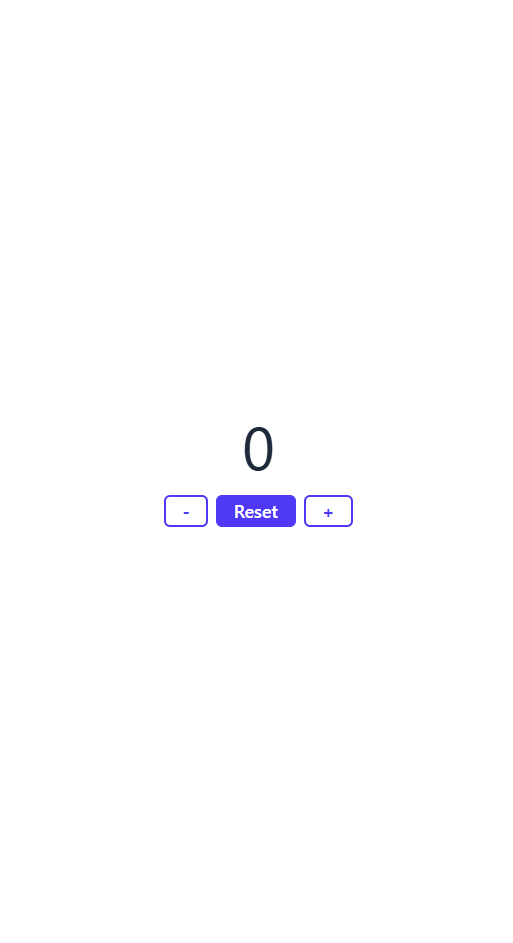

# 🔢 Counter App – JavaScript Interactive Counter

A simple, clean, and responsive counter app built using **HTML**, **Tailwind CSS**, and **JavaScript**.  
Users can increment, decrement, and reset the counter with a modern interface.

Designed by **Stephen William G. De Jesus**, this app demonstrates real-time state manipulation with accessible and animated UI patterns.

---

## 📸 Preview

### 🎞️ Live Interaction (GIF)  
<!-- Add your GIF to the images folder and update the path -->


### 🖼️ Full Page Screenshot  
<!-- Add your screenshot to the images folder and update the path -->


---

## 🌐 Live Demo

[View Live Demo](https://yourusername.github.io/counter-app/) <!-- Replace with your GitHub Pages URL -->

---

## ✨ Features

✅ Increment and decrement buttons  
✅ Reset button to return to zero  
✅ Smooth transitions and instant updates  
✅ Responsive design using Tailwind CSS  
✅ ARIA-labeled buttons for accessibility

---

## 🛠️ Built With

- [HTML5](https://developer.mozilla.org/en-US/docs/Web/Guide/HTML/HTML5)  
- [Tailwind CSS](https://tailwindcss.com/)  
- [JavaScript](https://developer.mozilla.org/en-US/docs/Web/JavaScript)

---

## 🚀 Getting Started

To run this project locally:

```bash
git clone https://github.com/yourusername/counter-app.git
cd counter-app
open index.html
